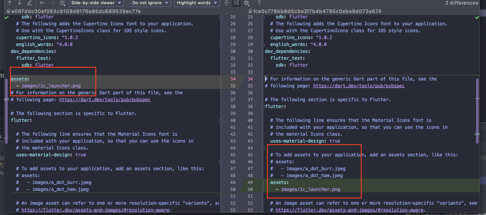

1. 在terminal中运行flutter命令的方法

   zsh: command not found: flutter，如果环境变量按照官方配置完成，针对mac系统，可以先运行**source ~/.bash_profile**，然后在运行flutter命令，这只能适用单次。

2. 注意: 由于**yaml 文件对缩进严格**，所以必须严格按照每一层两个**空格的方式进行缩进**，此处assets前面应有两个空格。

3. **assets的位置和空格不正常**导致，这张图片在后续的页面中无法加载。

   

4. A RenderFlex overflowed by 74 pixels on the bottom.出现黄黑斜杠。

   主要是view的空间不够，考虑可滑动的view或者其他可展开组件
   
5. ***assert()注意点：***在生产环境代码中 `assert()` 函数会被忽略，不会被调用。 在开发过程中, `assert(*condition*)` 会在非 `true` 的条件下抛出异常.有关更多信息，参考 [Assert](https://www.dartcn.com/guides/language/language-tour#assert).