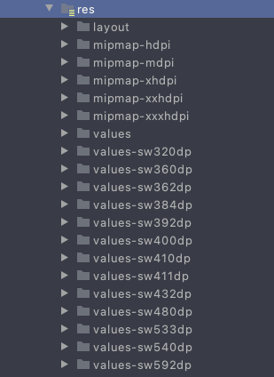
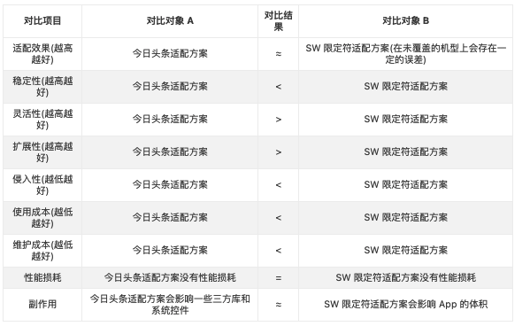

我们普遍的适配时是照屏幕的百分比进行适配，大屏幕和小屏幕显示的内容是相同的。dp，px和DPI之间存在如下关系：

***dp=px/(DPI/160)***

#### 最小宽度限定符（SmallestWidth）

这种方案的***最小宽度是设计人员的设计稿的宽度**，通过插件生成各种宽度的dimens.xml文件。最终会生成如下图的文件结构：

values-sw432dp类似的文件夹是根据你需要适配的屏幕宽度生成的，根据自己的需求进行增减，同时他越多，app的体积就会越大。

里面使用的插件为：**SmallestWidth Dimens**，使用简单。也可以使用其他插件甚至是复制都可以，但是需**要注意最小宽度是否符合自己的最小宽度**

使用时直接用dimens.xml中的数值。

#### 今日头条适配方案

成熟的第三方库：[AndroidAutoSize](https://github.com/JessYanCoding/AndroidAutoSize)使用简单。

最小宽度限定符和今日头条适配方案比较：

今日头条对第三方库对ui产生很大的影响。

#### 善于使用 wrap_content、match_parent、weight

百分比适配方案，默认都是以宽度为标准去适配，所以高度不能百分百适配所有的机型，

在可以使用**wrap_content、match_parent、weight**的时候还是要使用他们的，对适配只有好处没有坏处。

相对布局（**RelativeLayout**）或者约束布局（**ConstraintLayout**）是推荐使用的。

