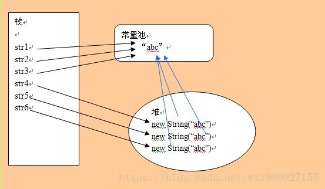

#### equals和==的区别

1. ==比较的对象在内存中的首地址是否相同

2. equals对于**字符串和基本数据类型的包装类**进行比较是比较的内容，对非字符串比较时和==相同据类型，type，short，int，long，char，float，double，boolean只能使用==，不能使用equals

3. 对于一些对象如果没有重写equals和hashcode方法一般，用equals方法时和==相同，比较的是地址，因为object方法里的equals方法就是==，可以看源码。

   ***注意String a="111";String b="111";a==b返回true，为何地址是相同的？***

   如下图：

   

#### equals和hashcode

在HashSet集合中保存对象时，会用到equals方法和hashCode的方法来确定对象保存的位置。

要保证equals返回true时，hashCode也要相同，这样才是符合要求。

HashSet集合中保存对象时

* equals=true，hashcode相等正常存储
* equals=true，hashcode不相等，会保存在不同的位置
* equals=false，hashcode相等正常，会保存在同一个位置，此位置的多个对象以链表的形式保存
* equals=false，hashcode不相等，正常存储

***注意***equals和==的示例代码在**KotlinStudy**项目的**JavaLibrary**的**EqualsTest.java**中。

​         