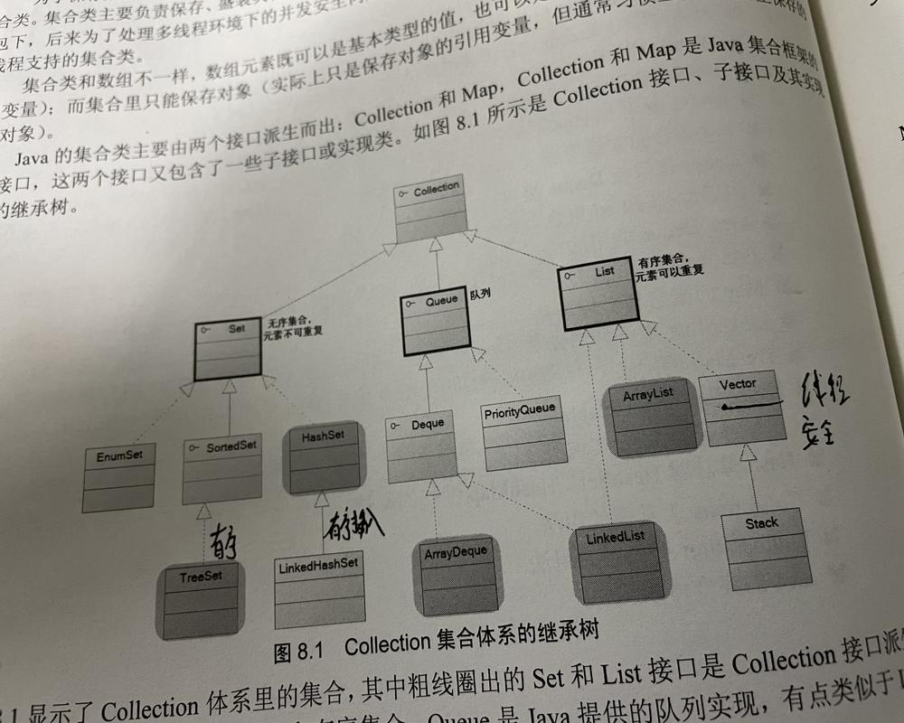

```
//HashSet,TreeSet,ArrayList,ArrayDeque,LinkedList,HashMap,TreeMap都是线程不安全的。
//可以用Collections提供的SynchronizedXXX方法保正线程安全
//HashSet 可以存null
//LinkedHashSet,可以存null，有插入时的顺序，性能比HashSet稍差。
//TreeSet 不可以存null，可以进行排序的set集合，根据值的实际大小，调用的compareTo
//EnumSet 不能存null


        /***
         * 性能分析，HashSet比TreeSet性能要好。LinkedHashSet要比普通的HashSet插入删除慢。但是遍历的速度快，这是由于链表要保证插入顺序的原因
         * EnumSet是性能最好的一个，但是只能用来保存同一个枚举类的值做集合，他们都不是线程安全的，需要Collections的synchronizedSortedSet方法保证线程安全
         */

        //ArrayList  线程不安全  性能相比Vector更好
        // Vector    线程安全   可以当作"栈" first in，last out；先进后出

        //Queue 集合 FIFO 先进先出
        //PriorityQueue 队列，和TreeSet类似，会进行排序，也不能存null
        //Deque 双端队列 ArrayDeque 双端队列也可以当成栈
        //LinkedList 链表，插入、删除性能好，随机访问性能不如ArrayList和ArrayDeque。

        //普遍ArrayList的性能比LinkedList要好
        //一般来数，由于数组以一块连续内存来保存所有的数组元素，所以数组在随机访问性能最好；所有的内部以数组作为底层实现的集合在随机访问时性能最好，而内部
        //以链表作为底层实现的集合在执行插入、删除时性能较好。
        //线程安全问题

```




priorityQueue，是有序队列。

***注意***示例代码在**KotlinStudy**项目的**JavaLibrary**的**CollectionBaseTest.java**中。

